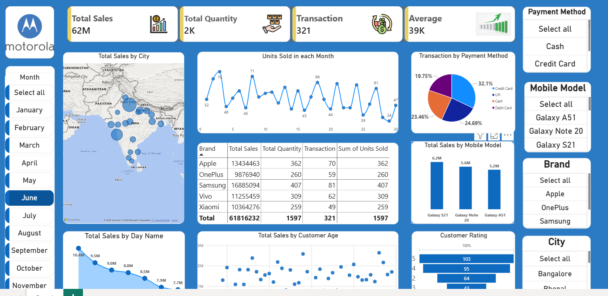

# 📊 Motorola Mobile Sales Dashboard

## 📌 Overview

The Motorola Mobile Sales Dashboard is an interactive Power BI dashboard designed to analyze mobile sales performance across different brands, mobile models, cities, months, payment methods, and customer demographics.

The dashboard provides a consolidated view of sales, quantity sold, transactions, customer ratings, and model-wise performance through interactive visualizations and filters.

## 🎯 Objectives

- Analyze overall mobile sales performance
- Track total sales, quantity sold, and transactions
- Compare sales performance across different brands and mobile models
- Analyze monthly and daily sales trends
- Understand sales distribution across different cities
- Analyze customer payment preferences
- Study customer ratings and age-wise sales
- Provide interactive filtering for detailed analysis

## 🛠️ Tools & Technologies

- Power BI
- Power Query
- DAX
- Data Visualization
- Interactive Slicers
- Map Visualization

## 📊 Key Performance Indicators

The dashboard includes the following key metrics:

- **Total Sales:** 62M
- **Total Quantity:** 2K
- **Total Transactions:** 321
- **Average Sales:** 39K

These metrics update dynamically based on the selected filters.

## 📈 Dashboard Features

### 1. Total Sales by City

A map visualization showing the geographical distribution of mobile sales across different cities.

### 2. Units Sold in Each Month

A line chart displaying the number of units sold across different days of the month to identify sales patterns and fluctuations.

### 3. Transactions by Payment Method

A pie chart showing the distribution of transactions across different payment methods:

- Credit Card
- UPI
- Cash
- Debit Card

### 4. Brand-wise Sales Analysis

A detailed table comparing different mobile brands based on:

- Total Sales
- Total Quantity
- Transactions
- Units Sold

The dashboard includes brands such as:

- Apple
- OnePlus
- Samsung
- Vivo
- Xiaomi

### 5. Total Sales by Mobile Model

A column chart comparing total sales generated by different mobile models, including Galaxy S21, Galaxy Note 20, and Galaxy A51.

### 6. Total Sales by Day Name

A visualization showing the variation in total sales across different days.

### 7. Total Sales by Customer Age

A scatter chart showing the relationship between customer age and total sales.

### 8. Customer Rating

A visualization representing the distribution of customers across different rating levels.

## 🎛️ Interactive Filters

The dashboard provides interactive slicers for:

- Month
- Payment Method
- Mobile Model
- Brand
- City

Users can select individual or multiple values to dynamically analyze the dashboard.

## 🔍 Key Insights

The dashboard can be used to identify:

- Top-performing mobile brands
- Best-selling mobile models
- Monthly and daily sales patterns
- Sales distribution across cities
- Preferred payment methods
- Customer rating distribution
- Relationship between customer age and sales
- Changes in sales performance based on selected filters

## 💼 Business Use Case

This dashboard can help mobile retailers and sales teams monitor sales performance and understand customer purchasing behavior.

By using interactive filters, users can analyze sales at different levels, such as brand, mobile model, city, month, and payment method.

## 🚀 Future Enhancements

- Add year-over-year sales analysis
- Add sales growth percentage
- Add profit and profit margin analysis
- Add sales forecasting
- Add top-performing city and model KPIs
- Add drill-through pages
- Add dynamic tooltips
- Connect the dashboard to a live data source

## 📷 Dashboard Preview

## 📂 Project Information

**Project Name:** Motorola Mobile Sales Dashboard  
**Tool:** Microsoft Power BI , Excel 
**Domain:** Sales & Business Analytics  
**Dashboard Type:** Interactive Data Visualization
